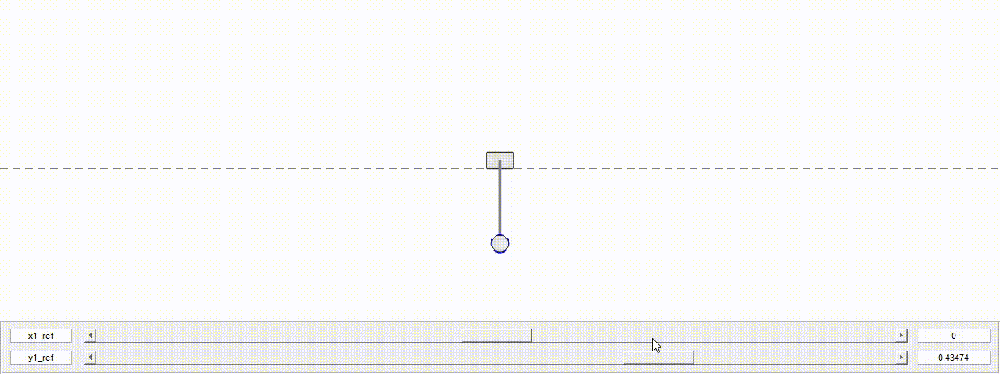

# CartPoleControl
Cart pole trajectory control and balancing, reinforcement learning training environment and visualization in Matlab.

Included agents have been trained with DDPG (Deep Deterministic Policy Gradient) method.  

Tested with Matlab version 2023a.
